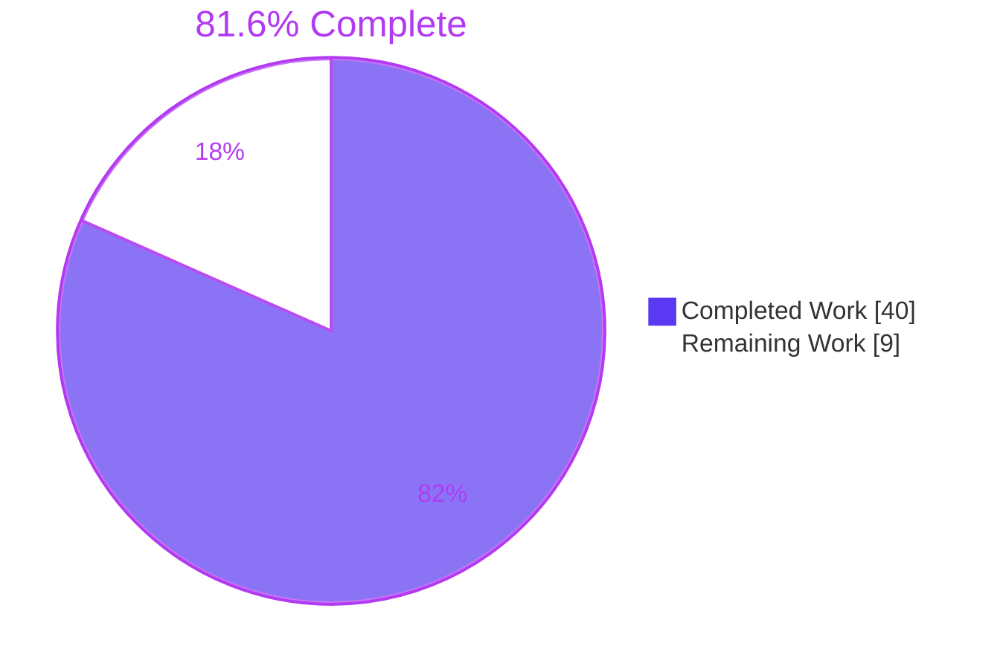
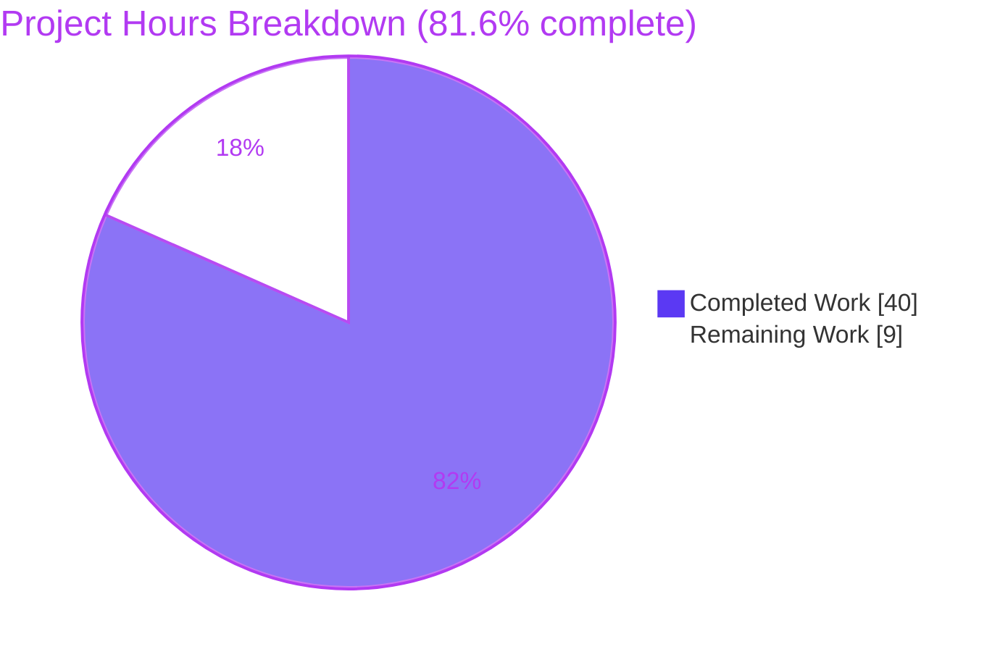
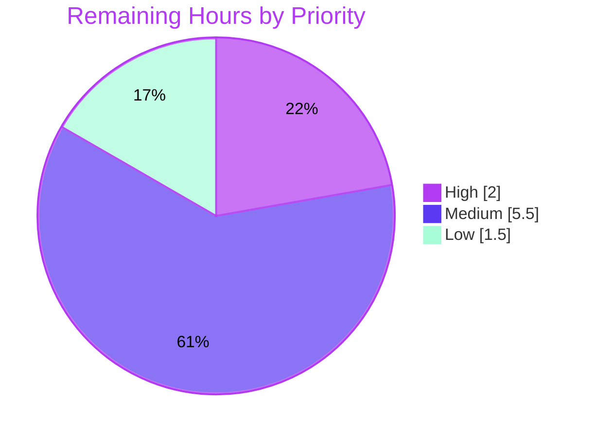

# 1. Executive Summary

## 1.1 Project Overview

A self-contained Node.js 24 tutorial project: an HTTP server with one endpoint, `/hello`, that returns the plain-text body `Hello world` to any HTTP client. It teaches developers new to server-side Node.js the request/response cycle through two ES-module source files (`src/app.js`, `src/server.js`), an eight-case `node:test` suite and a step-by-step `README.md`. It has zero dependencies, binds to loopback by default and runs with `npm start` and `npm test`. Hosting, CI and operational tooling are out of scope.

## 1.2 Completion Status



| Metric | Value |
|---|---|
| Total Hours | 49 |
| Completed Hours (AI + Manual) | 40 (40 AI + 0 manual) |
| Remaining Hours | 9 |
| Percent Complete | 81.6% |

40 hours completed out of 49 total hours = 81.6% complete. Every AAP deliverable is built and verified; the remaining 9 hours are review, cross-platform verification and sign-off.

## 1.3 Key Accomplishments

- ✅ Byte-exact `/hello` contract: GET/HEAD 200, other methods 405 with `Allow: GET, HEAD`, other paths 404
- ✅ Malformed targets such as `http://[` return 404 without crashing the server (`src/app.js:53`)
- ✅ `npm test` passes 8 of 8 with no warnings; `src/app.js` has 100% line and branch coverage
- ✅ Validated `PORT`/`HOST`, loopback default, one-line startup failures, SIGINT/SIGTERM shutdown
- ✅ Log lines neutralise injected newlines, escape codes and invisible characters
- ✅ Zero dependencies; `npm ci` and `npm audit` find 0 vulnerabilities
- ✅ README excerpts match the source verbatim; its commands reproduce on Linux
- ✅ Exactly the seven planned files, with no excluded tooling or routes

## 1.4 Critical Unresolved Issues

0 of the 6 AAP functional requirements are open, and nothing blocks release. 4 items need owner sign-off:

| Issue | Impact | Owner | ETA |
|---|---|---|---|
| Ctrl+C under `npm start` where `/bin/sh` is bash (macOS, Fedora), and always under `npm run dev`, can stop the server before it prints `Received SIGINT, shutting down` (Section 5.2, D2) | Readers may not see the documented shutdown line; open requests are cut rather than drained | Project owner | 1.5 h |
| `npm start` followed by Ctrl+C gives npm exit status 130, not the AAP's "exits with code 0"; the server process itself exits 0 (D1) | Manual-check wording differs from the AAP | Project owner | Within 1 h sign-off |
| Windows (PowerShell, cmd.exe) and macOS instructions in `README.md` have never been executed | Unverified guidance for those readers | QA engineer | 3 h |
| Node.js 26 satisfies `engines: ">=24"` but has never been run | Unknown behaviour on the next LTS line | Developer | 1 h |

## 1.5 Access Issues

No access issues identified. The project calls no external service and needs no credentials.

## 1.6 Recommended Next Steps

1. [High] Review and merge the branch after re-running `CI=true npm ci && CI=true npm test && CI=true npm audit`.
2. [Medium] Run the README end to end on Windows and macOS.
3. [Medium] Accept the Ctrl+C shutdown-line caveat, or approve a signal-handling change that departs from `process.once`.
4. [Medium] Sign off the other six divergences in Section 5.2.
5. [Low] Run the gate on Node.js 26 and decide whether to recommend Node 24.18.1 or later.

# 2. Project Hours Breakdown

## 2.1 Completed Work Detail

| Component | Hours | Description |
|---|---|---|
| Project scaffolding | 1.5 | `package.json` with the exact eight keys and three scripts (`start`, `dev`, `test`), no dependencies or licence; npm-generated `package-lock.json` (lockfileVersion 3, single root entry); `.gitignore` with `node_modules/` and `npm-debug.log*` |
| `/hello` application module (`src/app.js`) | 4 | `handleRequest` and `createServer` exports with JSDoc; `send()` helper with explicit charset, byte-derived `Content-Length` and a guard against overriding either; `URL.parse` routing, path-before-method order, 200/405/404 responses; side-effect-free import |
| Entry point (`src/server.js`) | 7 | `PORT` default and integer/range validation, `HOST` loopback default, startup line with IPv6 bracketing and real bound port, `'error'` listener for startup failures, log escaping, flush before exit, `process.once` SIGINT/SIGTERM shutdown |
| Contract test suite (`test/app.test.js`) | 5 | Eight AAP-named `node:test` cases on an ephemeral loopback port; hooks that surface bind and close failures; uncaught-exception monitors that fail a broken handler fast instead of hanging |
| Tutorial documentation (`README.md`) | 14 | 978-line tutorial: prerequisites, install, run (port, host, watch mode, stopping, startup failures), calling the endpoint, running the tests, and a walkthrough of all four code files with verbatim excerpts |
| Verification and acceptance | 8.5 | Whole-package gate, AAP 0.11 manual check, hostile-request and hostile-configuration probes, browser check, README command and excerpt verification, mutation testing of the suite |
| **Total** | **40** | |

## 2.2 Remaining Work Detail

| Category | Hours | Priority |
|---|---|---|
| Code review and merge of the branch, re-running the gate | 2 | High |
| Cross-platform README verification: Windows PowerShell and cmd.exe (`curl.exe`, `$env:PORT`, `set PORT`, Ctrl+C) and macOS bash/zsh | 3 | Medium |
| Ctrl+C shutdown-line decision under `npm start` with bash and under `npm run dev` (D2): accept the caveat or approve a signal-handling change | 1.5 | Medium |
| Sign-off of divergences D1 and D3–D7 | 1 | Medium |
| Node.js 26 compatibility run: gate plus manual check | 1 | Low |
| Runtime patch-floor guidance: decide whether the README recommends Node 24.18.1 or later | 0.5 | Low |
| **Total** | **9** | |

## 2.3 Hours Calculation

- Completed: 1.5 + 4 + 7 + 5 + 14 + 8.5 = **40 hours**
- Remaining: 2 + 3 + 1.5 + 1 + 1 + 0.5 = **9 hours**
- Total: 40 + 9 = **49 hours**
- Completion: 40 / 49 × 100 = **81.6%**

Estimates for the remaining work carry medium confidence: the cross-platform run may surface wording changes, and the D2 decision grows to about 4 hours if a signal-handling change is approved rather than the caveat accepted.

# 3. Test Results

All results below come from `CI=true npm ci && CI=true npm test && CI=true npm audit` and `node --check` on Node v24.21.0 with npm 11.19.0. The gate exited 0, printed `ℹ tests 8`, `ℹ pass 8`, `ℹ fail 0`, `ℹ cancelled 0`, finished in about 150 ms, printed no `ExperimentalWarning` or `DeprecationWarning`, and created no `node_modules/`. Coverage was measured separately with `node --test --experimental-test-coverage`.

| Area / Category | Framework | Tests | Passed | Failed | Coverage | What This Proves |
|---|---|---|---|---|---|---|
| Greeting contract: GET, query string, HEAD (cases 1–3) | `node:test`, `node:assert/strict`, global `fetch` | 3 | 3 | 0 | `src/app.js` 100% line, branch and function (whole suite) | `/hello` returns 200, `text/plain; charset=utf-8`, `Content-Length: 11` and exactly `Hello world`; the query is ignored; HEAD carries the same headers and no body |
| Off-path behaviour: 405, 404, path-before-method, trailing-slash and case variants (cases 4–7) | `node:test`, `fetch` | 4 | 4 | 0 | Included above | Other methods on `/hello` get 405 with `Allow: GET, HEAD`; any other path gets 404 whatever the method; matching is exact and case-sensitive |
| Crash resistance (case 8) | `node:test`, `node:http` | 1 | 1 | 0 | Included above | An unparseable target `http://[` gets 404 and the next request still gets 200 `Hello world` |
| Syntax check of all JavaScript | `node --check` | 3 checks | 3 | 0 | n/a | `src/app.js`, `src/server.js` and `test/app.test.js` parse on Node 24 |
| Reproducible install and supply chain | `npm ci`, `npm audit` | 2 checks | 2 | 0 | n/a | The lockfile installs as committed, the package has no dependencies, and there are 0 known vulnerabilities |

**Not Covered** — delivered but not exercised by any automated test:

- `src/server.js` as a whole: `PORT`/`HOST` defaults and validation, the startup line, startup-failure messages, log escaping, flush-before-exit and signal shutdown. The AAP fixes the suite at eight cases that never import the entry point, so these rest on the runtime checks in Section 4. Re-run the AAP 0.11 manual check before each release.
- The dropping behaviour of the `send()` header guard (`src/app.js:25-29`): the filter runs on every response, but no route passes an extra `Content-Type` or `Content-Length`, so no test sees one dropped.
- The 404 and 405 `Content-Length` values (9 and 18): correct at runtime but not asserted by any case.
- The test hooks' failure branches (bind error, close error) and the crash monitors: they only run when something breaks, so a passing run does not execute them.
- A handler that never replies, or an async handler that rejects, would hang `npm test`: the suite deliberately uses no timeouts.
- Windows, macOS and Node.js 26 have never run the suite.

# 4. Runtime Validation & UI Verification

The server was run with `npm start`, `node src/server.js` and `node .` on Node v24.21.0 and driven with curl, raw sockets and Chrome. The project has no UI; the browser renders the plain-text body.

- ✅ **Startup** — `npm start` prints the npm banner and `Server listening on http://127.0.0.1:<port>`; only the loopback address listens; `PORT=0` logs the port the OS assigned; `node .` runs the same entry point.
- ✅ **Primary journey (curl)** — `curl -s -w "\n" …/hello` prints `Hello world`; `curl -sS -i` shows the exact documented header block; `/goodbye` prints `Not Found`; `-X POST` prints `Method Not Allowed` with `Allow: GET, HEAD` and `Content-Length: 18`.
- ✅ **Browser (Chrome)** — `/hello` renders `Hello world` (200, `text/plain; charset=utf-8`, 11 bytes, no trailing newline); `/goodbye` and `/Hello` show 404 `Not Found`; an in-page `fetch` POST returns 405 with `Allow: GET, HEAD`; the only console errors are the expected favicon 404 and the 404/405 responses.
- ✅ **Hostile requests** — malformed targets, request smuggling, oversized headers (Node 431), unrecognised method tokens (Node 400) and `CONNECT` (closed) never reached a crash; the same process kept serving `Hello world` and wrote nothing to stderr.
- ✅ **Configuration failures** — `PORT=abc` prints `Invalid PORT "abc": expected an integer from 0 to 65535` and exits 1; a second `npm start` on a busy port prints the `EADDRINUSE` line and exits 1 while the first server keeps serving; an unresolvable `HOST` prints `getaddrinfo ENOTFOUND`; injected newlines and invisible characters appear as `\uXXXX` escapes on one line.
- ✅ **Shutdown by signal to the server process** — SIGINT and SIGTERM print their shutdown line, exit 0 and free the port; a second signal ends a shutdown held open by a client.
- ⚠ **Ctrl+C and `kill` through npm** — npm exits with status 130 (143 for SIGTERM); under bash as `/bin/sh` or under `npm run dev` the shutdown line can be skipped; on dash a signal sent only to npm's pid leaves the server running on its port. All three are documented in `README.md:144-201`, and the documented `lsof` remedy was verified.
- ⚠ **`npm run dev`** — restarts on every in-place save; after a save that replaces the file, it restarts once and then stops noticing that file until `npm run dev` is restarted (documented in `README.md:135-139`).
- ⚠ **`HOST=::1`** — the bracketed `http://[::1]:<port>` line was verified only in an isolated network namespace; on a host with IPv6 loopback disabled it prints `listen EADDRNOTAVAIL` and exits 1, as the README states.
- ⚠ **Not exercised at runtime** — Windows (PowerShell, cmd.exe, Ctrl+C and SIGTERM behaviour), macOS shells, and Node.js 26.

# 5. Compliance & Quality Review

## 5.1 Compliance Matrix

| # | AAP Deliverable | Benchmark | Status | Progress |
|---|---|---|---|---|
| 1 | `package.json` (0.4.1) | Exact eight keys in order, three scripts, no dependencies, `engines: ">=24"` | ✅ Pass | 100% |
| 2 | `package-lock.json`, `.gitignore` (0.5.2) | npm-generated lockfile v3 with one root entry; exactly two ignore patterns | ✅ Pass | 100% |
| 3 | FR-1 Single endpoint | Only `/hello` answers 200; no root, health or extra route | ✅ Pass | 100% |
| 4 | FR-2 Greeting response | Byte-exact `Hello world`, `text/plain; charset=utf-8`, `Content-Length: 11`, HEAD without body | ✅ Pass | 100% |
| 5 | FR-3 Off-path behaviour | 405 with `Allow`, 404 path-first, unparseable target survives | ✅ Pass | 100% |
| 6 | FR-4 One-command start | `npm start`, validated `PORT`/`HOST`, four log lines, clean shutdown | ⚠ Pass with caveats (D1, D2) | 95% |
| 7 | FR-5 Tutorial documentation | All 0.4.5 sections, verbatim excerpts, commands reproduce | ⚠ Pass on Linux; Windows and macOS unverified | 90% |
| 8 | FR-6 Verifiable behaviour | `npm test` runs exactly the eight named cases, 8 of 8 pass | ✅ Pass | 100% |
| 9 | Security NFR (0.3.2) | Loopback default, non-throwing `URL.parse`, no body reads, no reflection, zero dependencies | ✅ Pass | 100% |
| 10 | Portability NFR | Shell-neutral npm scripts; README gives bash, PowerShell and cmd.exe forms | ⚠ Scripts neutral; not run off Linux | 80% |
| 11 | Runtime hygiene (0.10.2) | No `ExperimentalWarning` or `DeprecationWarning` from `npm start` or `npm test` | ✅ Pass | 100% |
| 12 | Code standards (0.10.1, 0.4.5) | `node:` imports, named exports, `const` only, two-space style, JSDoc on exports, why-comments, no TODO markers | ✅ Pass | 100% |

## 5.2 AAP & Rule Divergences and Gaps

| # | What the AAP/Rule Required | What Was Delivered Instead | Why It Diverged | Impact | Remediation |
|---|---|---|---|---|---|
| D1 | AAP 0.11: after Ctrl+C on `npm start`, "the process exits with code 0" | The server exits 0; npm exits 130 (`README.md:153-155`) | npm receives the same Ctrl+C and treats the script as interrupted | Wording only | Accept |
| D2 | AAP 0.4.5/0.11: Ctrl+C prints `Received SIGINT, shutting down`; 0.10.1 clean `close()` | Under `npm start` with bash as `/bin/sh`, and under `npm run dev`, the server can stop at once without the line (`README.md:157-167`) | A second SIGINT is forwarded after the mandated `process.once` handler has run | Line may be missing; open requests cut | Accept caveat or approve a signal-handling change |
| D3 | AAP 0.4.3: `<url-host>` is `HOST` "exactly as configured" | Invisible and control characters print as `\uXXXX` (`src/server.js:89`) | A `HOST` with an invisible character still binds, so the raw line misleads | None for ordinary hosts | Accept |
| D4 | AAP 0.4.1 Component B and the "two small source modules" NFR | `escapeForLog()`, `flush()`, top-level `await` and signal-handler removal added (`src/server.js:23-48,61,76`) | Log injection (CWE-117) and log loss on `process.exit()` were not covered by the AAP design | About 45 more lines for readers | Accept or simplify |
| D5 | AAP 0.4.1 Component C hooks plus eight cases; 0.10.1 no global handlers | Hook error paths, two `uncaughtExceptionMonitor` listeners and an extra case-8 assertion (`test/app.test.js:23-61,149-154,164`) | Without them a broken handler or failed bind hangs `npm test` silently | Names, count and AAP assertions unchanged | Accept |
| D6 | AAP 0.4.1: `send()` "merges any extra headers" | Extras named `Content-Type`/`Content-Length` in any case are dropped (`src/app.js:25-29`) | Enforces the AAP's "header rules hold on every path" | None on current responses | Accept |
| D7 | AAP 0.4.1: `dev` restarts "whenever `src/server.js` or `src/app.js` changes" | After a replace-save, watch mode restarts once then stops noticing (`README.md:135-139`) | Node.js 24 watch mode follows the file it loaded | Stale code for some editors | Accept documented caveat |

**D1 — npm exit status on Ctrl+C.** AAP 0.11 ends the manual check with "the process exits with code 0". The server process does exit 0: `shutdown()` in `src/server.js:93-106` calls `process.exit(0)` from the `close()` callback. npm, however, receives the same terminal Ctrl+C and exits with status 130, the conventional status for an interrupted command. The AAP fixes both the `start` script (0.4.1) and the `process.once` design (0.10.1), so no code change can alter npm's status. `README.md:153-155` states both numbers and shows `node src/server.js` for the server's own code. Nothing is functionally wrong; the owner only needs to accept the wording.

**D2 — shutdown line under bash and watch mode.** The AAP promises that Ctrl+C prints `Received SIGINT, shutting down` and closes the server cleanly. When `/bin/sh` is bash (macOS, Fedora), bash execs node, so npm's forwarded SIGINT reaches the server as a second signal; Node.js watch mode does the same under `npm run dev`. The first SIGINT consumes the `process.once` handler (`src/server.js:111-113`), so the second falls through to Node's default and ends the process, sometimes before the line flushes. `README.md:157-167` documents this per shell. The owner must accept the caveat or approve a change, such as ignoring a duplicate SIGINT, that departs from the AAP's escape-hatch design.

**D3 — escaped host in the startup line.** AAP 0.4.3 prints `<url-host>` as `HOST` exactly as configured. `src/server.js:89` passes it through `escapeForLog()`, because Node's name lookup drops invisible characters: `HOST=local<U+200B>host` binds, yet printed raw its URL would carry bytes the terminal does not show. The invalid-`PORT` and startup-failure lines are escaped the same way. Every value the AAP names (`127.0.0.1`, `0.0.0.0`, hostnames, `[::1]`) prints byte-identical, so only hostile or accidental input looks different. No action is required beyond accepting the choice, which the code comment and the README walkthrough explain.

**D4 — a larger entry point.** AAP 0.4.1 describes `src/server.js` as five steps, and the simplicity NFR asks for two small modules. The delivered file is 113 lines because it adds `escapeForLog()` (lines 23-34), which keeps each diagnostic on one ASCII-safe line against injected newlines, escape codes and bidi overrides; `flush()` (lines 43-48), awaited before every `process.exit()` so a slow pipe does not drop the mandated line; and removal of the signal handlers on the failure path (line 76) so exit code 1 survives a late signal. The AAP did not anticipate these risks. The README walks through both helpers; the owner may accept them or strip them for a shorter tutorial.

**D5 — test harness additions.** AAP 0.4.1 Component C specifies `before`/`after` hooks around eight cases, and 0.10.1 forbids global exception handlers. `test/app.test.js` adds an `'error'` rejection in `before` and a guarded, rejecting `after` (lines 25-61), a suite-wide `uncaughtExceptionMonitor` that closes connections when the handler throws (lines 23, 43, 57), a case-8 monitor that names the real error (lines 149-154), and a body assertion on case 8's follow-up (line 164). Without them a bind failure or a typo in `src/app.js` makes `npm test` hang with no output. A monitor only observes, so errors still fail the run. The eight names, their order and the AAP assertions are unchanged.

**D6 — reserved-header guard in `send()`.** AAP 0.4.1 says `send()` "merges any extra headers (the 405 `Allow`)". `src/app.js:25-29` first drops any extra named `Content-Type` or `Content-Length` in any letter case, because Node's `writeHead()` does not fold case, so a differently cased key would be sent as a second, conflicting header. This enforces the AAP's own guarantee that the header rules hold on every path. Header order, the `Allow` contract and every current response are byte-identical. The eight-case suite cannot reach the guard, so it rests on code review. Accepting it costs nothing; removing it would reopen the override path for readers who add routes.

**D7 — watch mode after a replace-save.** AAP 0.4.1 describes `npm run dev` as restarting "whenever `src/server.js` or `src/app.js` changes". Node.js 24 watch mode follows the file it loaded, so an editor or tool that saves by writing a new file and renaming it over the old one (as `sed -i` does) triggers one restart and then no more for that file. The script stays `node --watch src/server.js` because the AAP fixes its value and the portability NFR rules out shell-specific wrappers. `README.md:135-139` tells readers to restart `npm run dev` or save in place. The owner only needs to accept the documented limitation.

**User rules.** The single user rule ("Rule 1: this rule", body "asd") states no verifiable requirement, so nothing can diverge from it. Every other behaviour a reader might question — `Number()` accepting forms such as `0x10` or a whitespace-only `PORT`, `HOST=0` binding all interfaces, `/x/../hello` normalising to `/hello`, and Node's own 400/431 answers — follows the AAP as written and is not a divergence.

# 6. Risk Assessment

| Risk | Category | Severity | Probability | Mitigation | Status |
|---|---|---|---|---|---|
| Ctrl+C under `npm start` with bash as `/bin/sh`, or under `npm run dev`, ends the server without its shutdown line or a graceful drain (D2) | Technical | Low | High on macOS and Fedora | Documented per shell in `README.md:157-167`; `node src/server.js` always prints the line; owner decides on a signal-handling change | Open — decision pending |
| `src/server.js` has no automated test, so a regression in configuration, logging or shutdown passes `npm test` | Technical | Medium | Medium | Re-run the AAP 0.11 manual check (Section 9, Verification steps) before each release; the AAP fixes the suite at eight cases | Accepted |
| A future handler that never replies, or an async handler that rejects, hangs `npm test` because the suite uses no timeouts | Technical | Low | Low | The shipped handler is synchronous and cannot throw; CI jobs should set an outer timeout | Accepted |
| `engines: ">=24"` admits Node 24 builds older than 24.18.1 that carry known runtime CVEs; `npm audit` cannot see runtime advisories | Security | Medium | Low | Install the current Node 24 LTS (v24.21.0 used here); optionally add a README note naming 24.18.1 as the floor | Open — guidance pending |
| `HOST=0.0.0.0` or `HOST=0` exposes the server on every interface; `Number()` accepts forms such as `0x50`, and a whitespace-only `PORT` selects a random port | Security | Low | Low | Loopback is the default; the README warns about `0.0.0.0`; the startup line always shows the real host and port | Accepted (AAP 0.4.3) |
| On dash systems a signal sent only to npm's pid leaves the server running on its port, so the next start fails with `EADDRINUSE` | Operational | Low | Medium | `README.md:169-198` explains signal delivery and gives a verified `kill -TERM "$(lsof -ti tcp:3000 -sTCP:LISTEN)"` remedy | Mitigated (documented) |
| Windows and macOS instructions (`curl.exe`, `$env:PORT`, `set PORT`, Ctrl+C, SIGTERM, zsh) have never been executed | Integration | Medium | Medium | Run the README end to end on both platforms before publishing | Open |
| Node.js 26 is admitted by `engines` but unverified; Node 24 enters Maintenance LTS on 2026-10-20 | Integration | Low | Low | Run the gate on Node 26 after its LTS release (2026-10-28); keep the README prerequisites on a supported line | Open |

# 7. Visual Project Status



**Remaining hours by priority** (9 hours, from Section 2.2):



| Priority | Hours | Categories |
|---|---|---|
| High | 2 | Code review and merge |
| Medium | 5.5 | Cross-platform verification (3), Ctrl+C decision (1.5), divergence sign-off (1) |
| Low | 1.5 | Node.js 26 run (1), runtime patch-floor guidance (0.5) |
| **Total** | **9** | |

# 8. Summary & Recommendations

The project delivers everything the Agent Action Plan scoped: a zero-dependency Node.js 24 server whose only endpoint, `/hello`, returns `Hello world`, plus its manifests, an eight-case test suite and a 978-line tutorial README, in exactly the seven planned files. The work stands at **81.6% complete — 40 of 49 hours**. Every functional requirement (FR-1 to FR-6) is built and verified on Linux; the 9 remaining hours are human review, cross-platform verification and sign-off decisions rather than missing features.

Verification is strongest where the tutorial makes promises. `npm test` passes 8 of 8 with no warnings and covers every line and branch of `src/app.js`; `npm ci` and `npm audit` confirm a reproducible, dependency-free install with 0 vulnerabilities. The running server was exercised with curl, raw sockets and Chrome: responses match the AAP to the byte, hostile targets never crash it, it listens on loopback only, configuration errors produce one readable line and exit 1, and signals delivered to the server shut it down with exit 0. The main coverage gap is `src/server.js`, which no automated test imports; its behaviour rests on runtime checks, so the AAP 0.11 manual check should be repeated before each release.

The open items are narrow. Ctrl+C through npm gives exit status 130, and where npm's shell is bash, or under `npm run dev`, it can end the server before the shutdown line prints (D1, D2). The owner must accept that documented caveat or approve a signal-handling change. Five further divergences (D3–D7) are additive hardening or documented Node.js behaviour and need only sign-off. Windows, macOS and Node.js 26 have never run the project.

The critical path to release is: review and merge the branch after re-running the gate (2 h); run the README on Windows and macOS (3 h); settle D2 and sign off the other divergences (2.5 h); then confirm Node.js 26 and decide on a Node 24.18.1 runtime floor (1.5 h). Success looks like the same gate output on every platform (`ℹ tests 8`, `ℹ pass 8`, `ℹ fail 0`, `found 0 vulnerabilities`) and every README command reproducing its documented output.

**Production readiness:** ready to publish as the teaching prototype the AAP defines once the cross-platform run and the D2 decision are complete. It is not, by design, a production deployment: TLS, authentication, rate limiting, health endpoints, CI and hosting are out of scope.

# 9. Development Guide

Every command below runs from the repository root and was executed on Linux with Node v24.21.0 and npm 11.19.0; outputs are the ones observed, with durations and dates marked where they vary.

**System prerequisites**

- Node.js 24 LTS or later. `node --version` must print `v24.` or higher. Node 22 is not supported: `engines` is `>=24`, and Node 22 prints TAP instead of the `spec` output the README shows when output is piped.
- npm 11.x, bundled with Node.js 24.
- curl (Windows PowerShell users type `curl.exe`) or a web browser.
- Any OS that runs Node.js 24. Linux is verified; macOS and Windows are not yet.
- No database, container runtime, message broker or network access is needed.

**Environment setup**

- There is no virtual environment, `.env` file or global package.
- Two optional environment variables configure the server (Appendix E): `PORT` (default `3000`) and `HOST` (default `127.0.0.1`).
- If several Node.js versions are installed, make sure Node 24 comes first on `PATH`:

```bash
node --version
npm --version
```

Expected: `v24.21.0` (or a later 24.x/26.x) and `11.19.0` (or a later 11.x).

**Dependency installation**

The project has no dependencies, so installing only confirms that `package.json` and `package-lock.json` agree:

```bash
npm install
```

```text
up to date, audited 1 package in 151ms

found 0 vulnerabilities
```

For a clean, lockfile-exact install (as CI would run it):

```bash
CI=true npm ci
```

Neither command creates `node_modules/`.

**Application startup**

Foreground (stop with Ctrl+C):

```bash
npm start
```

```text
> node-hello-tutorial@1.0.0 start
> node src/server.js

Server listening on http://127.0.0.1:3000
```

Other ways to start it:

```bash
# Another port (bash/zsh)
PORT=4000 npm start

# Let the OS pick a free port; the log shows the real one
PORT=0 npm start

# Reachable from other machines on the network (trusted networks only)
HOST=0.0.0.0 npm start

# Restart automatically when src/server.js or src/app.js is saved in place
npm run dev

# Same entry point without npm
node .
```

PowerShell: `$env:PORT = "4000"` then `npm start`. cmd.exe: `set PORT=4000` then `npm start`.

Background run with a log file, then a clean stop by signalling the process that owns the port:

```bash
PORT=3000 nohup npm start > "$HOME/node-hello-server.log" 2>&1 &
sleep 1 && cat "$HOME/node-hello-server.log"
kill -INT "$(lsof -ti tcp:3000 -sTCP:LISTEN)"
```

The log ends with `Received SIGINT, shutting down` and the port is freed.

**Verification steps**

1. Automated gate — must exit 0 and print `ℹ tests 8`, `ℹ pass 8`, `ℹ fail 0` and `found 0 vulnerabilities`, with no `ExperimentalWarning` or `DeprecationWarning`:

```bash
node --check src/app.js && node --check src/server.js && node --check test/app.test.js
CI=true npm ci && CI=true npm test && CI=true npm audit
```

2. Manual check (AAP 0.11) with the server running in a first terminal:

```bash
curl -s -w "\n" http://127.0.0.1:3000/hello
curl -sS -i http://127.0.0.1:3000/hello
curl -s -w "\n" http://127.0.0.1:3000/goodbye
curl -s -w "\n" -X POST http://127.0.0.1:3000/hello
```

Expected, in order: `Hello world`; the header block below; `Not Found`; `Method Not Allowed`.

```text
HTTP/1.1 200 OK
Content-Type: text/plain; charset=utf-8
Content-Length: 11
Date: Wed, 30 Sep 2026 17:11:20 GMT
Connection: keep-alive
Keep-Alive: timeout=5

Hello world
```

The `Date` value varies, and the shell prompt follows `Hello world` on the same line because the body has no trailing newline.

3. Startup-failure check: while the first server runs, `npm start` in a second terminal prints `Failed to start server: listen EADDRINUSE: address already in use 127.0.0.1:3000` on stderr and exits 1 (`echo $?` prints `1`); the first server keeps serving.

4. Configuration check: `PORT=abc npm start` prints `Invalid PORT "abc": expected an integer from 0 to 65535` and exits 1.

5. Shutdown check: Ctrl+C in the first terminal prints `Received SIGINT, shutting down`. npm exits with status 130; `node src/server.js` run directly exits 0.

**Example usage**

- Browser: open `http://127.0.0.1:3000/hello`; it shows `Hello world` as plain text. A 404 for `/favicon.ico` in the console is expected.
- Headers only: `curl -sS -I http://127.0.0.1:3000/hello` returns `200 OK` with `Content-Length: 11` and no body.
- From JavaScript: `await (await fetch('http://127.0.0.1:3000/hello')).text()` returns `'Hello world'`.

**Troubleshooting**

| Symptom | Cause | Resolution |
|---|---|---|
| `Failed to start server: listen EADDRINUSE: address already in use 127.0.0.1:3000` | Another process, often an earlier server, holds the port | Choose another `PORT`, or stop the old one with `kill -TERM "$(lsof -ti tcp:3000 -sTCP:LISTEN)"` |
| `Invalid PORT "<value>": expected an integer from 0 to 65535` | `PORT` is not an integer in range | Unset it or use a value from 0 to 65535 |
| `Failed to start server: getaddrinfo ENOTFOUND <host>` | `HOST` does not resolve | Unset `HOST` or use `127.0.0.1`, `0.0.0.0`, `localhost` or `::1` |
| `Failed to start server: listen EADDRNOTAVAIL: address not available ::1` | IPv6 loopback is disabled on the machine | Use `127.0.0.1`, or enable IPv6 loopback |
| npm prints exit status 130 after Ctrl+C | npm treats the script as interrupted; the server itself exited 0 | Expected; run `node src/server.js` to see the server's own code |
| After `kill <npm pid>`, the next start fails with `EADDRINUSE` | On dash systems the signal never reached the server, which is still running | `kill -TERM "$(lsof -ti tcp:3000 -sTCP:LISTEN)"` |
| `npm run dev` stops restarting after a save | The editor saved by replacing the file; watch mode follows the original file | Restart `npm run dev`, or configure the editor to save in place |
| `npm test` prints TAP (`TAP version 13`) instead of `✔` lines | Node 22 or older is first on `PATH` | Put Node 24 first on `PATH` and re-run |
| `curl` in Windows PowerShell rejects `-s` or `-w` | `curl` is an alias for `Invoke-WebRequest` there | Type `curl.exe` |

# 10. Appendices

## A. Command Reference

| Command | Purpose |
|---|---|
| `npm install` | Confirm `package.json` and `package-lock.json` agree (no downloads) |
| `CI=true npm ci` | Lockfile-exact clean install |
| `npm start` | Run `node src/server.js` on `127.0.0.1:3000` |
| `npm run dev` | Run with `node --watch`, restarting on in-place saves of `src/server.js` or `src/app.js` |
| `node .` | Run the entry point named by `main` |
| `npm test` | Run `node --test`, which discovers `test/app.test.js` |
| `node --test --experimental-test-coverage` | Informational line/branch/function coverage table (the flag is experimental, so it is not part of the gate) |
| `CI=true npm audit` | Supply-chain check |
| `node --check <file>` | Syntax check without running |
| `kill -TERM "$(lsof -ti tcp:3000 -sTCP:LISTEN)"` | Stop the server that owns port 3000 |

## B. Port Reference

| Port | Used by | Notes |
|---|---|---|
| 3000 | `npm start`, `npm run dev`, `node .` | Default; override with `PORT` |
| 0 | `PORT=0`, and every test run | The OS assigns a free port; the server logs it, and tests read it from `server.address().port` |
| Any 0–65535 | `PORT=<n>` | Ports below 1024 may need elevated privileges (`EACCES`) |

## C. Key File Locations

| Path | Role |
|---|---|
| `src/app.js` | `handleRequest()` and `createServer()`: routing and every response; no side effects on import |
| `src/server.js` | Entry point: `PORT`/`HOST`, startup line, startup-failure messages, log escaping, signal shutdown |
| `test/app.test.js` | Eight `node:test` contract cases on an ephemeral loopback port |
| `package.json` | Manifest: ES modules, `engines: ">=24"`, `start`/`dev`/`test` scripts, no dependencies |
| `package-lock.json` | npm-generated lockfile v3 with a single root entry |
| `.gitignore` | `node_modules/` and `npm-debug.log*` |
| `README.md` | The tutorial: prerequisites through a line-by-line code walkthrough |

## D. Technology Versions

| Technology | Version | Notes |
|---|---|---|
| Node.js | v24.21.0 (Krypton, Active LTS) | Required `>=24`; Maintenance LTS from 2026-10-20, end-of-life 2028-04-30 |
| npm | 11.19.0 | Bundled with Node.js 24.21.0 |
| llhttp (Node HTTP parser) | 9.4.3 | Bundled with Node.js |
| `node:test`, `node:assert/strict`, `node:http`, global `fetch`, `URL.parse` | Built in, stable on Node 24 | No third-party packages |
| JavaScript | ES modules (`"type": "module"`) | No build step, no TypeScript |

## E. Environment Variable Reference

| Variable | Default | Rules | Example |
|---|---|---|---|
| `PORT` | `3000` when unset or empty | Converted with `Number()`; must be an integer from 0 to 65535, otherwise the process prints `Invalid PORT "<value>": expected an integer from 0 to 65535` and exits 1. `0` asks the OS for a free port | `PORT=4000 npm start` |
| `HOST` | `127.0.0.1` when unset or empty | Passed to `listen()` unchanged; `0.0.0.0` exposes all IPv4 interfaces, `::1` binds IPv6 loopback and logs `http://[::1]:<port>`; an unbindable value prints `Failed to start server: <message>` and exits 1 | `HOST=0.0.0.0 npm start` |

## F. Developer Tools Guide

- **Live reload:** `npm run dev` uses Node's built-in watch mode. Each restart logs `Received SIGTERM, shutting down` from the old process and a new `Server listening on` line. One Ctrl+C stops it at once.
- **Testing:** `node:test` with its default `spec` output. Tests never import `src/server.js`, so they pass while your own server holds port 3000. A handler exception fails the affected cases within about 0.3 s and prints the error.
- **Adding a route:** add a branch in `handleRequest()` in `src/app.js` before the 404 fallback; the README section "Where a new route would go" explains where.
- **No linter or formatter** is configured by design; the style is two-space indentation, single quotes, semicolons, trailing commas and lines under about 100 characters.

## G. Glossary

| Term | Meaning |
|---|---|
| Ephemeral port | A free port the OS assigns when a server listens on port 0 |
| HEAD | An HTTP method identical to GET except that the response carries no body |
| 405 Method Not Allowed | Status for a known path requested with an unsupported method; it must list accepted methods in `Allow` |
| Loopback | The `127.0.0.1` (IPv4) or `::1` (IPv6) interface, reachable only from the same machine |
| `URL.parse()` | WHATWG URL parser that returns `null` instead of throwing on invalid input |
| `process.once` | Registers a listener that runs for the first event only; a second Ctrl+C then uses Node's default handling |
| Watch mode | `node --watch`, which restarts a script when a file it loaded changes |
| CWE-117 | Improper output neutralisation for logs: untrusted text forging or disguising log lines |
